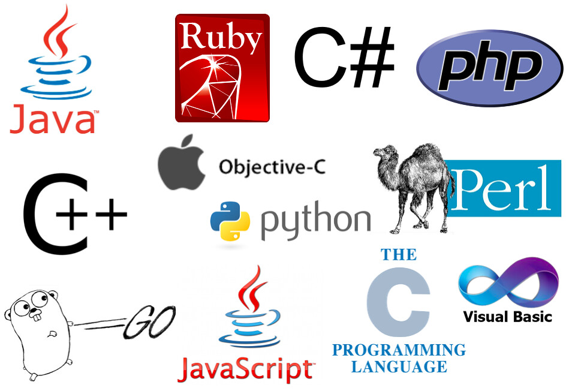

# Leetcode Algorithm Hack


## 项目移交

从 2020-10-30 起，将本项目移交至计算所苏州分组织：**中科院计算所苏研院**

Joke 🌝

> PHP is the best language in the world! 😂 😂 😂

> PHP 是全世界最好的语言! 😂 😂 😂

## 概述

苏研院是中国科学院计算技术研究所下属的地方研究所，位于苏州工业园区。本项目为员工在组织自发发起的头脑风暴项目，专门用于员工打发工作之余的空闲时间。

题库来自LeetCode，不同的员工使用不同的开发语言，对LeetCode上的算法题洗刷。

## 算法有用吗？

总有人说大神是不会刷算法的，"面试造火箭，工作宁螺丝”，我不反对，但是无论如何算法是编成的思想，很多高效的软件，编译器，工具都是基于很好的算法实现的，你不是为了工作学习算法的，你是为了让自己的代码更加优秀，让自己的大脑更加聪明而学习算法的。我很反对通过刷算法来提高找工作的机会，很反对不懂语言的艺术，不爱编程，不懂设计模式，甚至长期耗时间在 Leetcode 上却没有任何实战经验的伪程序员。

我只想说，一个 Geek 必须要懂得算法，更要知道算法的实际运用场景，要会用。一个好的工程师要能够掌握多种语言，并且知道什么环境使用什么语言。说到底，算法是程序的灵魂，而语言，操作系统，编辑器，IDE 都是躯壳。

如果真的爱这一行，要愿意付出时间去折腾，去钻研，定会成为一个优秀的开发人员。

## 主要语言

-   JS
-   Kotlin(Native)
-   Java
-   C#
-   PHP
-   Python

## 💻 平台

Linux + Bash/Shell

## 环境安装

-   OpenJDK 11+ (apt 安装)
-   PHP 7+ (apt 安装)
-   Node 13+ (apt 安装 nvm，nvm 管理 Node)
-   Mono 4+ (apt 安装)
-   Kotlin-native (snap 安装)

## 🏃 开始

例如要运行 two sum 的案例

```bash
git clone https://github.com/devilyouwei/leetcode-algorithm-hack.git

./run.sh two-sum
```

## 🎨 已实现的算法

[Two Sum](two-sum/) Easy

[Add Two Numbers](add-two-numbers/) Medium

[Longest Substring Without Repeating Characters](congest-substring-without-repeating-characters/) Medium

[Median Of Two Sorted Arrays](median-of-two-sorted-arrays/) Hard

## 持续更新中

本 repo 持续更新中，算法有优劣，笔者尽量展示较为高效的代码。

## 贡献者

[Devil](https://github.com/devilyouwei)

[LouisdeBroglie](https://github.com/LouisdeBroglie)

[BOTAKKK](https://github.com/orgs/CAS-IICT/people/BOTAKKK)

[handsome913](https://github.com/orgs/CAS-IICT/people/handsome913)

[lly456](https://github.com/lly456)


